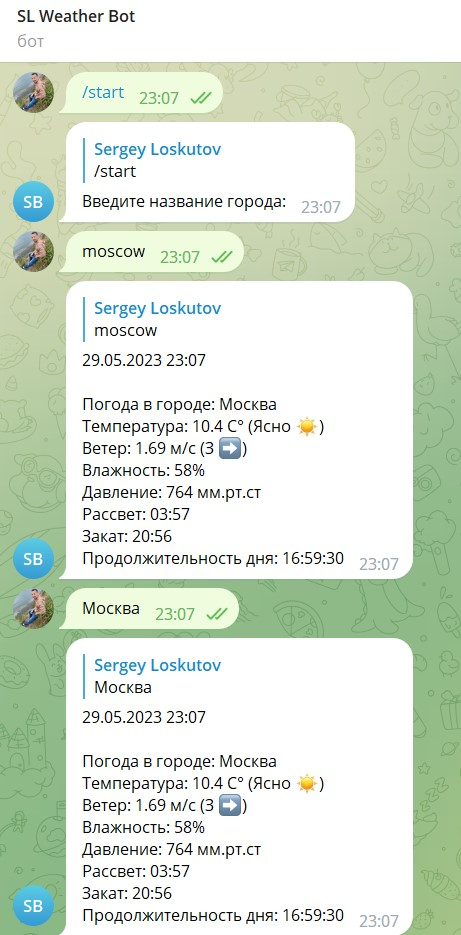

Телеграм бот, который показывает погоду, а именно:
- Температура
- Ветер
- Влажность
- Давление
- Время рассвета
- Время заката
- Продолжительность дня

Бот написан с использованием библиотеки aiogram.

Информация о погоде с ресурса: https://openweathermap.org/

Для работы нужно:
- Клонировать репозиторий и установить требуемые зависимости (pip install -r requirements.txt)
- Зарегистрироваться на https://openweathermap.org и получить токен для использования API
- Создать бота в @BotFather в самом телеграм. Получить токен своего бота (далее можно будет там же добавить описание и аватар)
- Токены API и телеграм бота прописать в соответствующие поля в config.py
- Запустить скрипт main.py